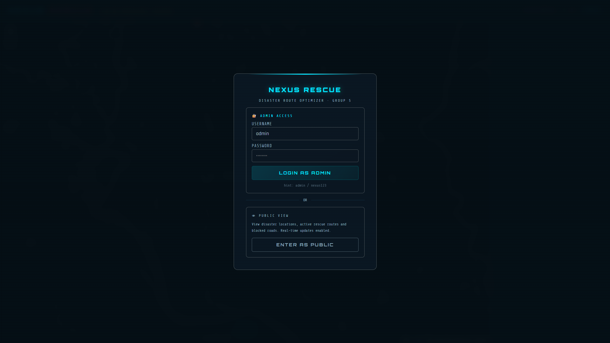
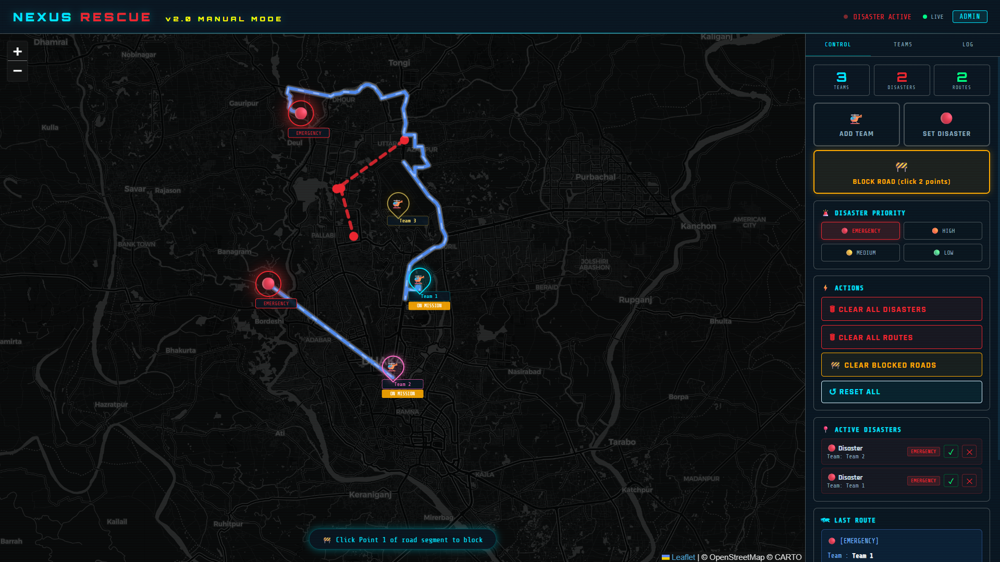
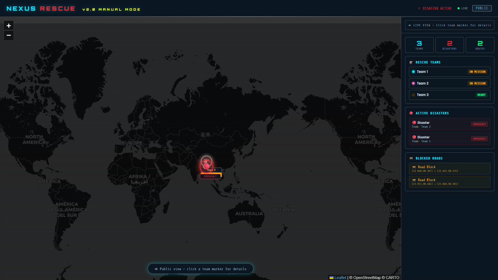

# NEXUS RESCUE
### Disaster Route Optimizer with Dynamic Hazard Management

[](https://sm-sayem-hossain.github.io/nexus-rescue/)
[](https://firebase.google.com/)
[](LICENSE)

---

## Overview

NEXUS Rescue is a real-time disaster response coordination system built as a Data Structure Lab project. It demonstrates core data structures and algorithms in a real-world context — managing rescue teams, computing optimal routes, and prioritizing disaster response across a live interactive map.

All data syncs in real time via Firebase. Admins control the operation; the public can monitor live.

---

## Data Structures & Algorithms

This is the core of the project. Every feature is backed by a specific data structure.

### Stack — Emergency Dispatch (LIFO)
Emergency-priority disasters are pushed onto a **Stack**. When a team is manually dispatched, it pops from the top (Last In, First Out) — the most recently reported emergency gets handled first, simulating real incident response urgency.

### Priority Queue — Multi-Priority Dispatch
Non-emergency disasters (High, Medium, Low) are managed in a **Priority Queue**. Disasters are ordered by severity, so higher-priority ones are always dispatched before lower ones regardless of arrival order.

### Dijkstra's Algorithm — Shortest Path Routing
When a team is assigned to a disaster, **Dijkstra's algorithm** computes the shortest road path. The OpenRouteService API handles real road graph traversal, and blocked roads are excluded from the graph using polygon avoidance — simulating edge removal in a weighted graph.

### BFS — Hazard Zone Propagation
**Breadth-First Search** is used in the C backend to propagate hazard levels outward from a disaster origin. Level 0 = danger zone, Level 1 = warning zone — spreading layer by layer like BFS explores nodes level by level.

### Greedy Algorithm — Team Assignment
When a new disaster is placed, the system uses a **Greedy approach** — it immediately picks the nearest available team based on route distance without backtracking or reconsidering. Fast and effective for real-time dispatch.

### Adjacency List — Road Graph (C Backend)
The road network in the C implementation is represented as an **Adjacency List** — each location node stores a linked list of connected roads with weights (distances). This is the foundation for both Dijkstra and BFS.

### Min-Heap — Dijkstra's Priority Queue
Dijkstra's algorithm in the C backend uses a **Min-Heap** to always extract the node with the smallest current distance — achieving O((V + E) log V) time complexity.

---

## Features

**Admin Panel**
- Deploy rescue teams with names and color codes
- Place disasters with 4 priority levels — Emergency, High, Medium, Low
- Stack visualization for emergency queue (LIFO)
- Priority Queue visualization for other disasters
- Manually reassign available teams (⇒) to unassigned disasters
- Mark disasters rescued (✓) — releases the team automatically
- Clear individual disasters (✕)
- Move team location via map click (📍) — drag is locked to prevent accidents
- Block roads using two-point selection — affects all route calculations
- Clear all disasters, routes, or blocks independently
- Full system reset

**Real-Time Sync**
- Firebase Realtime Database — instant cross-device sync
- Live connection indicator
- Public read-only view for monitoring

**Routing**
- Real road routing via OpenRouteService API
- Animated route lines with ETA and distance
- Blocked roads excluded from all route calculations

---

## Tech Stack

| Layer | Technology |
|-------|-----------|
| Map | Leaflet.js + CartoDB Dark Tiles |
| Routing | OpenRouteService API |
| Database | Firebase Realtime Database |
| Algorithm Backend | C |
| Frontend | HTML, CSS, JavaScript |
| Hosting | GitHub Pages |

---

## Repository Structure

```
nexus-rescue/
├── index.html              ← Root redirect
├── README.md
├── proposal.pdf            ← Project proposal
└── web/
    └── nexus_rescue.html   ← Full application (map, UI, Firebase, routing)
```

---

## How to Use

**Admin**
1. Open [nexus-rescue live](https://sm-sayem-hossain.github.io/nexus-rescue/)
2. Login with admin credentials
3. Add teams → place disasters → watch routes compute
4. Use ⇒ to manually assign available teams to unassigned disasters
5. Use ✓ when a rescue is complete — team returns to available
6. Use 📍 to reposition a team by clicking the map
7. Use BLOCK ROAD to simulate road closures

**Public**
1. Open the site — no login needed
2. Monitor live team positions, active disasters, and routes

---

## Live Demo

**[https://sm-sayem-hossain.github.io/nexus-rescue/](https://sm-sayem-hossain.github.io/nexus-rescue/)**

---

## Course Info

**Course:** CSE 124 — Data Structure Lab
**Group:** 5
**Institution:** Daffodil International University

---

*Data structures aren't just theory. This is proof.*

---

## Screenshots

### Login


### Admin View


### Public View

