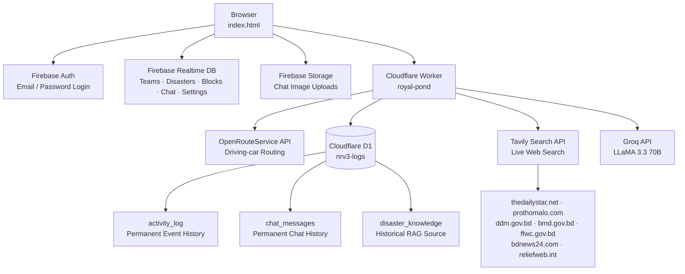
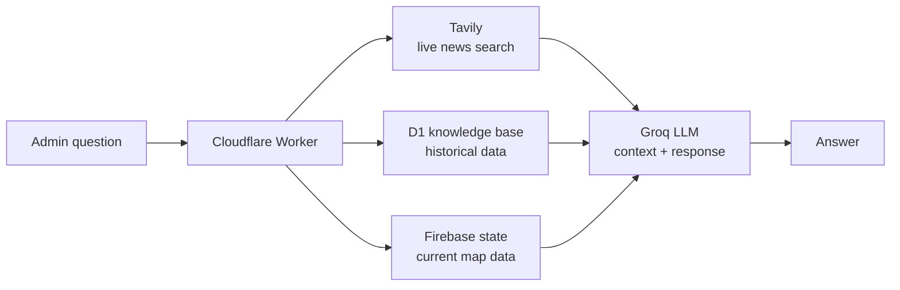

# NEXUS RESCUE

Real-time disaster response coordination platform for Bangladesh.

Live at [sm-sayem-hossain.github.io/nexus-rescue](https://sm-sayem-hossain.github.io/nexus-rescue/)

---

## What it does

NEXUS RESCUE lets multiple rescue coordinators work the same map simultaneously during an active disaster. Each admin deploys teams, marks road blocks, and tracks routes in real-time. A built-in AI assistant reads the live map state and answers operational questions — including web searches across Bangladeshi news outlets and government disaster portals.

The entire system ships as a single HTML file with no build step and no backend to maintain.

---

## Key Features

**Live map coordination** across multiple admins at once, with ownership-based permissions so each admin controls only their own teams and disasters. A Super Admin has full override access and manages who gets in.

**Intelligent auto-deployment** that assigns the nearest available team to each new disaster the moment it's placed on the map. Priority ordering follows a hybrid stack/queue structure — Emergency disasters use LIFO, everything else goes through a priority queue.

**Optimized routing** via OpenRouteService with active road block avoidance. When a block is marked on the map, subsequent routes calculate around it automatically.

**NEXUS AI** — a context-aware assistant that knows every active disaster, team position, road block, and ETA on the map right now. It searches live sources (Daily Star, Prothom Alo, DDM, BMD, FFWC) via Tavily and maintains conversation memory across the session.

**Permanent audit trail** — every action (disaster placed, team deployed, road blocked, rescue completed) is logged to a write-only SQL database with timestamp, coordinates, and admin identity. Nothing is ever deleted.

**Encrypted admin channel** — real-time group chat with image sharing, stored permanently alongside the activity log.

---

## Architecture



**AI query flow:**



---

## Structure

```
nexus-rescue/
├── index.html        # Entire frontend — map, UI, Firebase, AI chat
└── README.md
```

The Cloudflare Worker (`royal-pond`) is deployed separately and holds all API secrets. It exposes five endpoints:

```
POST /route    proxies OpenRouteService (ORS key hidden server-side)
POST /log      writes an activity event to D1
GET  /logs     reads activity history from D1
POST /chat     writes a chat message to D1
GET  /chat     reads chat history from D1
POST /ai       Tavily search + D1 lookup + Groq inference
```

---

## Tech Stack

| Layer | Technology |
|---|---|
| Frontend | Vanilla HTML/CSS/JS — zero frameworks, zero build step |
| Map | Leaflet.js 1.9.4 + CartoDB dark tiles |
| Realtime sync | Firebase Realtime Database |
| Authentication | Firebase Auth |
| File storage | Firebase Storage |
| Edge compute | Cloudflare Workers |
| Persistent storage | Cloudflare D1 (SQLite at the edge) |
| Routing | OpenRouteService — driving-car profile |
| AI inference | Groq — LLaMA 3.3 70B Versatile |
| Web search | Tavily Search API |
| Hosting | GitHub Pages / Cloudflare Pages |

---

## Database Schema

**Cloudflare D1**

```sql
CREATE TABLE activity_log (
  id           TEXT    PRIMARY KEY,
  event_type   TEXT    NOT NULL,
  admin_id     TEXT    NOT NULL,
  admin_name   TEXT    NOT NULL,
  details      TEXT,
  lat          REAL,
  lng          REAL,
  timestamp    INTEGER NOT NULL
);

CREATE TABLE chat_messages (
  id           TEXT    PRIMARY KEY,
  admin_id     TEXT    NOT NULL,
  admin_name   TEXT    NOT NULL,
  text         TEXT,
  image_url    TEXT,
  date         TEXT    NOT NULL,
  time         TEXT    NOT NULL,
  timestamp    INTEGER NOT NULL
);

CREATE TABLE disaster_knowledge (
  id            TEXT    PRIMARY KEY,
  source        TEXT    NOT NULL,
  title         TEXT,
  content       TEXT    NOT NULL,
  date          TEXT,
  location      TEXT,
  disaster_type TEXT,
  url           TEXT,
  collected_at  INTEGER
);
```

**Firebase Realtime Database**

```
/teams/{id}         name, lat, lng, color, available, ownerUid
/disasters/{id}     lat, lng, priority, assignedTeam, route{km,min,coords}, ownerUid
/blocks/{id}        p1{lat,lng}, p2{lat,lng}, ownerUid
/admins/{uid}       displayName, email, createdAt
/chat/{id}          admin_id, admin_name, text, image_url, date, time, timestamp
/settings/autoMode  boolean — synced across all admin sessions in real-time
```

---

## Access Levels

| Role | What they can do |
|---|---|
| Public | View map, active disasters, deployed teams, road blocks |
| Admin | Everything above, plus add/edit/delete own teams and disasters, mark road blocks, use AI and chat |
| Super Admin | Full system access, manage admin accounts, toggle auto-deployment globally |

---

## Priority System

Disaster dispatch uses a hybrid data structure. Emergency-level disasters are held in a stack and processed last-in-first-out. High, Medium, and Low priorities go into a priority queue ordered by severity. When Auto Deployment Mode is on, this ordering determines which disaster a newly available team gets assigned to.

---

## Security

All third-party API keys (ORS, Groq, Tavily) live exclusively in Cloudflare Worker environment secrets and are never sent to the browser. Firebase config is public by design; access control is enforced through Firebase Security Rules requiring `auth != null` on all write paths.

---

Built by S.M. Sayem Hossain
